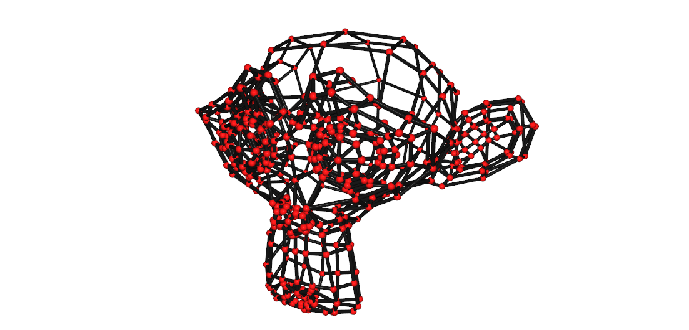
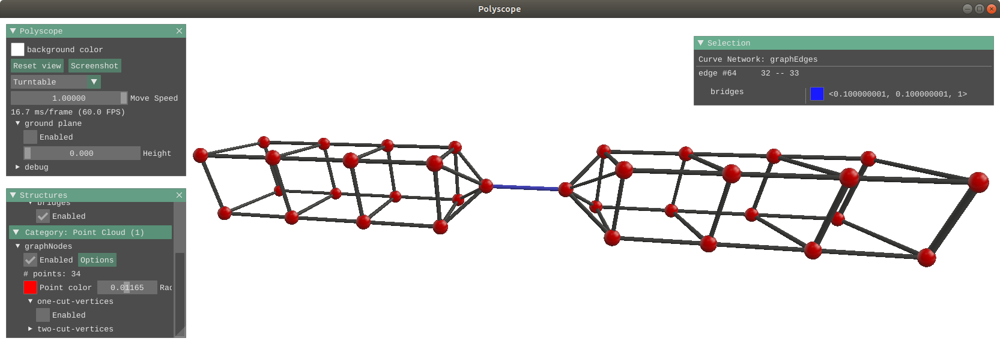
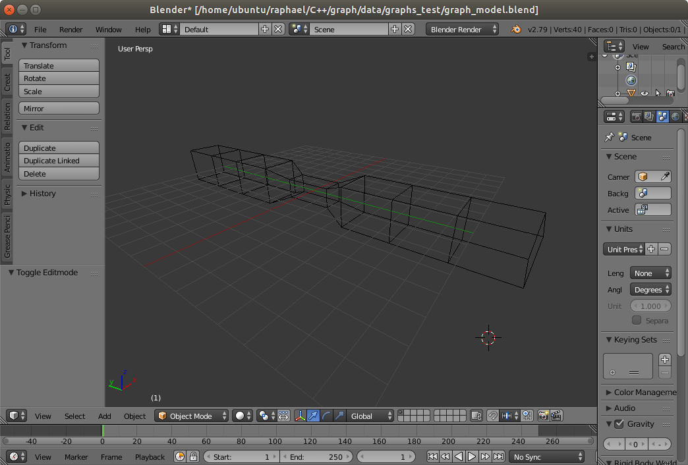

# Light C++ graph library

We provide a simple and light graph library for visualizing and analyzing graph structures. The library is inspired by [Libigl](https://github.com/libigl/libigl), following its design principle and applied for graphs. The graphs are stored as `.obj` files (not all other formats support edges) which can be easily edited in [Blender](https://www.blender.org/).



## Installation:
Install [Eigen](https://eigen.tuxfamily.org/) which is a dependency.

Then simply type the following commands in the command line:

To build the library and the example
```bash
mkdir build
cd build
cmake ../src
make
```

to build and run the tests:
```bash
mkdir build_tests
cd build_tests
cmake ../src/tests
make
```

## Features:
* graph instanciation from Eigen matrices ('Eigen::MatrixXd' for nodes position and 'Eigen::MatrixXi' for edges definition)
* graph visualization (using [polyscope](http://polyscope.run/)
* adding\removing nodes
* edge collapsing
* transformation into 1D curve
* connectivity (linear time)
* biconnectivity (linear time)
* triconnectivity (quadratic time)
* bridges detection (linear time)
* shortest path on the graph

## Features to add:
* graph augmentation

## Design principles:
* header only library
* simple structures for storing the graph (Eigen::Matrix) and adjacency lists (std::vector)
* easy to modify

## Graph visualization:


## Graph editing:
Open [Blender](https://www.blender.org/) and start creating a graph. A mesh can be easily transformed into a graph by deleting the faces only (change to `edit mode`, select everything `a`, open the delete menu `del`, pick `Only faces`). See this [cheatsheet](https://bcgiu.wordpress.com/2015/02/12/best-blender-key-map-infographic/) for a complete key map.


## Other alternatives:
* [OGDF](http://www.ogdf.net): (C++) self-contained class library for the automatic layout of diagrams. OGDF offers sophisticated algorithms and data structures to use within your own applications or scientific projects (including triconnectivity tests in linear time with SPQR decomposition)
* [BOOST](https://www.boost.org/doc/libs/1_70_0/libs/graph/doc/index.html): (more?) efficient implementation
* [Matlab graph class](https://www.mathworks.com/help/matlab/graph-and-network-algorithms.html): sweet one
